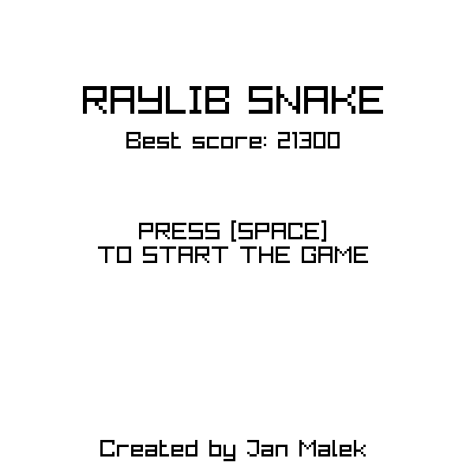
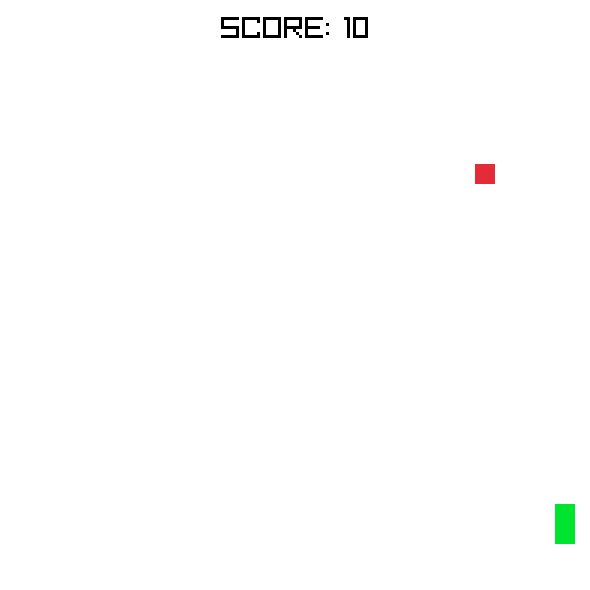

# RaylibSnake

A simple snake game made using `C++`, [`raylib`](https://www.raylib.com), [`CMake`](https://cmake.org) and [`emscripten`](https://emscripten.org)

 

## Project overwiew

This is a simple clone of Snake. Created using different tools to learn how to use them

### Features

- A classic snake gameplay where you have get as long as possible by eating red squares, and avoiding crashing into your own tail
- Scoring system: The longer you get the more points you get
- Written in C with some elements of C++ (references, namespaces)
- Compiled using with the help of `CMake` using `MinGW` for Windows and using `emscripten` for web

### Controls and game help

- Move the snake by using `WSAD` or `Arrow Keys`
- When you start the game the snake will not move. You have to start it's movement by pressing any direction key
- You can pause the game using `P`, the unpause it by pressing `P` again. You can also exit the game when paused by pressing `ESC`
- Your best score is saved updated and saved automaticly

### System requirements (for the provided executeable)
- 64-bit version of Windows
- Support for `OpenGL 3.3`

## Playing the game

There are two easy ways to play the game:
1. You can play it in your browser on [`itch.io`](https://kdt11.itch.io/raylibsnake)
2. You can download the provided Windows executable from the [releases](https://github.com/kdt111/RaylibSnake/releases) section

## Compiling the project

- Project uses `CMake` and will fetch required dependencies automaticly if they are not detected
- Simply download or clone this repository and build it using `CMake`
- The `CMakeLists.txt` file is formated to work with `MinGW`, so any compiler that has options similar to `GCC` should compile this project without problems

## File overview

- [main.cpp](main.cpp): Program's entry point and main file
- [CMakeLists.txt](CMakeLists.txt): Main `CMake` file for this project
- [src/include](src/include): Include files for different game functionality
- [src/engine.cpp](src/engine.cpp): Implementation file for handeling engine logic (window creation, game state management, etc...)
- [src/mainmenu.cpp](src/mainmenu.cpp): Implementation file for the main menu (handles updating and drawing)
- [src/game.cpp](src/game.cpp): Implementation file for handeling gameplay (updating, drawing)
