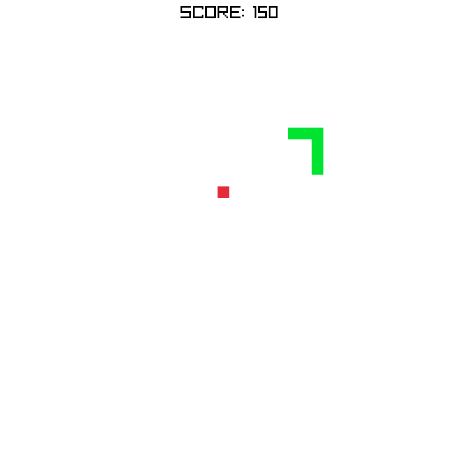

# RaylibSnake

A simple snake game made using [raylib](https://www.raylib.com) and C++



## Project overwiew

This is a simple clone of the game snake using [raylib 4.0](https://www.raylib.com). Created to learn how different things in this library work

### Features

- A classic snake gameplay where you have get as long as possible by eating red squares, and avoiding crashing into your own tail
- Scoring system: The longer you get the more points you get
- Written in C with some elements of C++ (references, namespaces)

### Controls and game help
- Move the snake by using `WSAD` or `Arrow Keys`
- When you start the game the snake will not move. You have to start it's movement by pressing any direction key
- You can pause the game using `P`, the unpause it by pressing `P` again. You can also exit the game when paused by pressing `ESC`
- Your best score is saved updated and saved automaticly

## Playing the game
1. If you just want to play the game and use Windows the you can download and run the file in the `Releases` section

## Compiling the project
1. Compiling for desktop:
	- Project uses `CMake` and will fetch required dependencies automaticly if they are not detected
2. Compiling for Web:
Project can be compiled for web using `emscripten`. To do that you nead to:
	- Have `emscripten` installed
	- From the 'build' folder delete:
		- `CMakeCashe.txt` file
		- `CMakeFiles` folder
	- From the command prompt run:
	```
	emcmake cmake -S . -B build -DPLATFORM=Web -DCMAKE_BUILD_TYPE=Release
	```
	- If the project was configured succesfully then run:
	```
	cmake --build build
	```

## File overview
1. In the root folder:
	- [main.cpp](main.cpp): Program's entry point and main logic
	- [LICENSE](LICENSE): raylib's licence file
	- [README.md](README.md): This file
2. In the [include](include) folder:
	- [raylib.h](include/raylib.h): raylib's main header file
	- [config.h](include/config.h): Different game configuration constants (eg. game speed, font size)
3. In the [lib](lib) folder:
	- [libraylib.a](lib/libraylib.a): Compiled library file of raylib, used for static linking. This file is Windows specific and was compiled using `MinGW`
4. In the [impl](impl) folder:
	- [game.cpp](impl/game.cpp): The logic for the game (eg. snake movement, collision detection, score counting)
	- [mainmenu.cpp](impl/mainmenu.cpp): The logic for drawing the entry screen of the game (eg. game title)
5. In the [.vscode](.vscode) folder:
	- [tasks.json](.vscode/tasks.json): Build tasks for `VSCode`, this file is only used when the project is opened in `VSCode`
